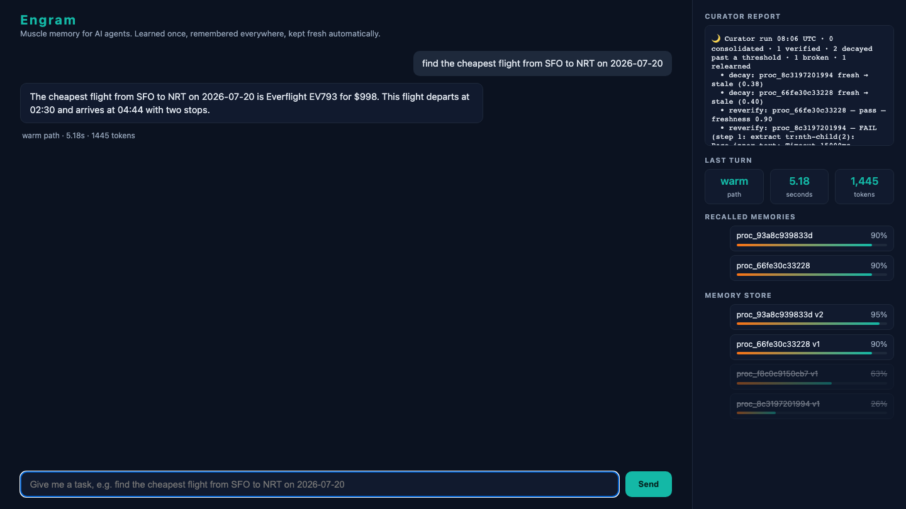
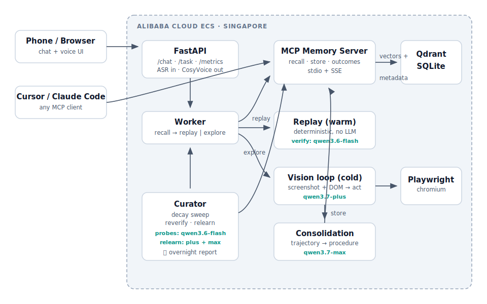
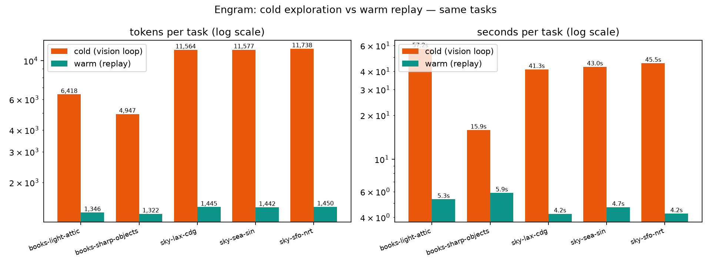
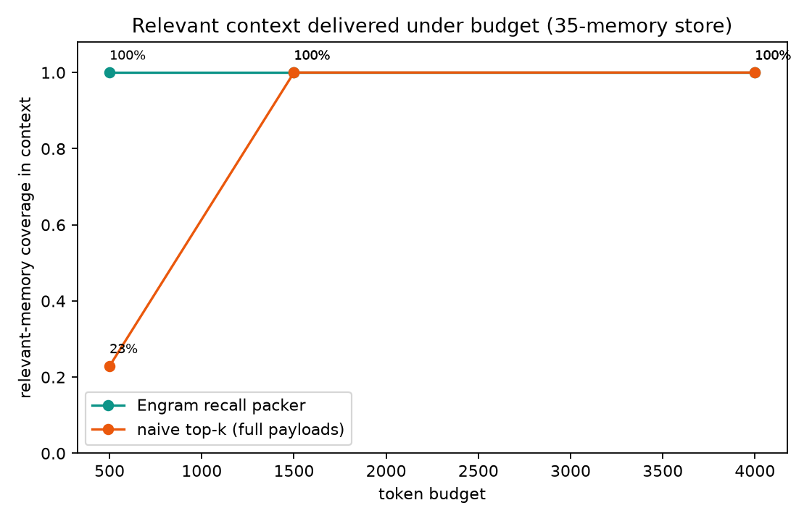
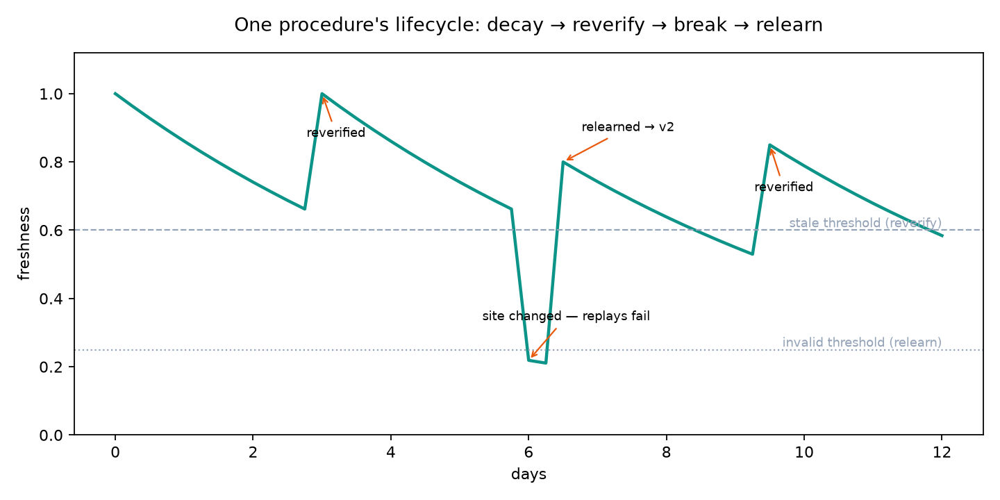

# Engram

**Muscle memory for AI agents: learned once, remembered everywhere, kept fresh automatically.**

  

Same task, measured on the benchmark suite in this repo:

| | cold (first time) | warm (from memory) |
|---|---|---|
| time | 43 s | 4.3 s |
| tokens | 11,600 | 1,450 |
| LLM calls | ~10 vision + 1 deep | 2 flash |



## The problem

Agents have amnesia. Every session, an agent rediscovers your tools pixel by
pixel with a vision loop, the slowest and most expensive thing agents do. Do
the same task tomorrow and it pays the full price again. Memory frameworks
store what the agent talked about, not what it learned to do.

## The idea

The first time Engram does a task, it explores like any browser agent, then
consolidates the trajectory into a structured procedure: minimal steps,
parameterized, with fallback selectors. Later runs replay that procedure
deterministically and verify the result with one cheap model call. A
background Curator keeps memories honest: freshness decays with age, stale
procedures get re-verified against the live site, broken ones get relearned
and diffed. Memory is served over MCP, so any client (Claude Code, Cursor,
this repo's chat UI) shares the same skills.

## Why we built the memory ourselves

Qwen Cloud provides models and embeddings, not a memory service, and the
ecosystem options (Mem0, ReMe, AgentScope memory) are conversational fact
stores. Track 1 asks for storage efficiency, timely forgetting, and
budget-constrained recall. Those are exactly the parts we wrote from scratch:
the recall packer, the decay function, consolidation, and the Curator live in
`src/engram/memory` and `src/engram/curator`, with Qdrant used as vector
storage only.

## 60-second quickstart

```bash
git clone https://github.com/Tanya-Khanna/engram.git && cd engram
uv venv --python 3.11 .venv && uv pip install --python .venv -e ".[dev]"
.venv/bin/playwright install chromium
cp .env.example .env        # put your DashScope key in DASHSCOPE_API_KEY

make demo-site &            # Skyfinder, the self-hosted demo target, on :8090
make demo-cold              # ~40 s: explores, consolidates, stores a procedure
make demo-warm              # ~4 s: recalls and replays it
make curator                # decay, reverify, relearn, overnight report
make serve                  # chat UI with the live memory panel on :8080/chat
```

Connect any MCP client (config blocks in [docs/mcp_setup.md](docs/mcp_setup.md)):

```bash
claude mcp add engram -- /path/to/engram/.venv/bin/python -m engram.server.mcp_server
```

## How it works



Three modes, three models, routed by `src/engram/llm.py` (the only file
allowed to call the API):

| mode | what happens | model | why |
|---|---|---|---|
| Awake (cold) | screenshot + DOM snapshot → plan → act → verify | qwen3.7-plus | needs vision and judgment |
| Awake (warm) | replay stored steps, verify final state | qwen3.6-flash | one cheap check, thinking disabled |
| Curious | trajectory → minimal parameterized procedure | qwen3.7-max | one-shot distillation is worth the best model |
| Asleep (Curator) | decay sweep, reverify probes, relearn | flash probes, plus + max relearn | probes are cheap until one fails |

Every call is metered (model, tokens, latency, purpose) into SQLite and
JSONL. The benchmark charts come straight from that log.

The cold path is guarded: cycle detection aborts loops, a step budget caps
runaway episodes, and the model's claim of "done" only counts after a
separate flash verdict on the final screenshot. Failed episodes are stored
too. The Curator learns from them.

## The memory lifecycle

Freshness is a pure function, not a vibe:

```
freshness(m) = exp(-AGE_LAMBDA * days_since(last_verified))
             * (1 - FAIL_PENALTY) ** failure_count
             * min(1, 0.8 + 0.05 * success_count)

AGE_LAMBDA = 0.15 for procedures (half-life ~4.6 days)
           = 0.02 for preferences (people change slowly)
freshness < 0.6  → stale   → reverify queue
freshness < 0.25 → invalid → relearn queue
```

A reverify probe is a deterministic replay plus one flash check. If it fails
against the live site, the procedure is marked invalid on the spot and the
Curator relearns it with the vision loop, versions it, and diffs old against
new. A real report from this repo, after the demo site changed its form ids
overnight:

```
🌙 Curator run 08:06 UTC · 0 consolidated · 1 verified · 2 decayed past a threshold · 1 broken · 1 relearned
  • reverify: proc_66fe30c33228: pass, freshness 0.90
  • reverify: proc_8c3197201994: FAIL (step 1: extract: timeout), marked invalid
  • relearned proc_8c3197201994 → proc_93a8c939833d (v2 created, v1 archived):
      - goto http://127.0.0.1:8090/results?origin={origin}&dest={dest}&date={date}
      + goto http://127.0.0.1:8090/results?from={origin}&to={dest}&date={date}
      est. savings preserved: 7,758 tokens/run
```

Relearned procedures get new ids and supersede the old version instead of
overwriting it, so failure history survives.

## Benchmarks

Reproduce with `make demo-site` running, then `make bench`. Real runs, no
simulation except chart 3's clock.





Chart 2 measures coverage: of the memories relevant to a task, how many fit
in the context budget. We report coverage rather than single-target accuracy
because at this store size (35 memories) retrieval is easy and accuracy
saturates at 100% for both strategies. Packing is where they differ: at a
500-token budget the packer delivers all relevant memories, naive top-k with
full payloads delivers 23%.



## Compared to

| | recipes | lifecycle | scope |
|---|---|---|---|
| **Almanac** (inspiration) | static recorded recipes | none: recipes rot silently | browser tasks |
| **Headroom** | compresses what agents read | n/a | context compression |
| **Mem0 / ReMe** | conversational facts | manual invalidation | chat memory |
| **Engram** | learned, parameterized, versioned procedures | decay + reverify + relearn, autonomous | procedural skills over MCP |

Almanac proved that recorded recipes beat re-exploration. Engram automates
the recording (consolidation), adds the missing lifecycle (the Curator), and
makes the memory portable (MCP).

## When not to use Engram

- One-shot tasks: consolidation costs more than it saves if you never repeat.
- High-variance UIs (aggressive A/B tests, canvas apps): procedures break
  faster than the Curator can relearn them.
- Auth-walled or CAPTCHA-guarded flows: replay works, but learning requires
  the vision loop to get in, and bot detection will fight it.

## Roadmap

Community procedure registry, cross-domain skill transfer, encrypted memory
sync. Production deployments can swap Qdrant for AnalyticDB for PostgreSQL,
Alibaba Cloud's managed vector store, behind the same store interface.

## Hackathon

Qwen Cloud Global AI Hackathon, Track 1 (MemoryAgent). Solo build by
[Tanya Khanna](https://github.com/Tanya-Khanna).

- Proof of deployment: [deploy/alibaba_proof.py](deploy/alibaba_proof.py) runs
  on an Alibaba Cloud ECS instance in Singapore
- ECS setup: [deploy/ecs_setup.md](deploy/ecs_setup.md)
- Build journal: [JOURNAL.md](JOURNAL.md)

MIT licensed. Issues and PRs welcome.
